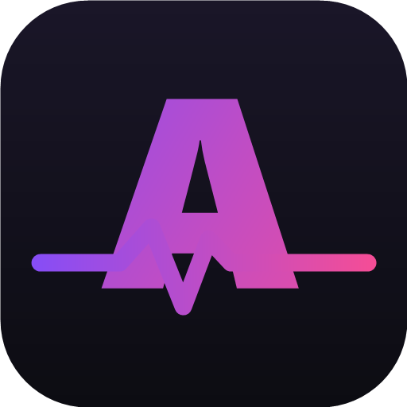

<div align="center">



# AniPulse

**Нативное Android-приложение для просмотра аниме с русской озвучкой**

Свой каталог · свой плеер · мини-соцсеть — чат, комментарии, друзья

[](https://kotlinlang.org)
[](https://developer.android.com/jetpack/compose)
[](https://developer.android.com/tools/releases/platforms)
[](#)

</div>

---

## Содержание

- [О проекте](#о-проекте)
- [Возможности](#возможности)
- [Технологии](#технологии)
- [Сборка из исходников](#сборка-из-исходников)
- [Структура проекта](#структура-проекта)
- [Конфиденциальность и правообладателям](#конфиденциальность-и-правообладателям)
- [Контакты](#контакты)

---

## О проекте

AniPulse — это Android-приложение для просмотра аниме с русской озвучкой: каталог тайтлов, свой встроенный видеоплеер и социальные функции вокруг просмотра (чат, комментарии, оценки, друзья). Приложение полностью нативное — никаких WebView-обёрток для основного функционала.

## Возможности

**Просмотр**
- Каталог с поиском, фильтрами и мультивыбором жанров, бесконечная прокрутка
- Витрина «Главная»: баннер-карусель онгоингов, «Продолжить просмотр», персональные рекомендации
- Страница тайтла: описание, жанры, статусы (Смотрю / В планах / Просмотрено), сетка серий
- Свой плеер (Media3 ExoPlayer): выбор качества и озвучки, жесты перемотки/яркости/громкости, точный пропуск опенинга и эндинга, автопереход к следующей серии
- Прогресс просмотра сохраняется локально и переживает переустановку благодаря синхронизации статистики
- Календарь: расписание выхода серий и лента свежих обновлений

**Соцчасть**
- Аккаунт (email + пароль с подтверждением почты) или вход через VK/Яндекс
- Общий чат и личные сообщения с @упоминаниями, ответами-цитатами, автодополнением ников
- Друзья с заявками и статусом «онлайн»
- Комментарии к тайтлам и отдельным сериям, свой рейтинг 1–10
- Модерация: мат-фильтр, блокировка агрессивных сообщений, спойлер-блюр, бан
- Push-уведомления без Google-сервисов (WorkManager) о новых сериях, сообщениях и упоминаниях

**Качество и безопасность**
- Токен и данные аккаунта хранятся зашифрованными на устройстве (EncryptedSharedPreferences)
- Восстановление пароля по коду на почту
- Анимированная заставка при запуске, плавные переходы между экранами, звуковые уведомления

## Технологии

| Слой | Инструменты |
|---|---|
| UI | Kotlin, Jetpack Compose, Material 3 |
| Архитектура | MVVM, Hilt (DI), Navigation Compose |
| Данные | Room (локальная БД), Retrofit + kotlinx.serialization, EncryptedSharedPreferences |
| Медиа | Media3 ExoPlayer |
| Фон | WorkManager (пуши без Google-сервисов) |

## Сборка из исходников

```bash
# 1. Скопируйте пример конфига и при необходимости заполните прокси
cp gradle.properties.example gradle.properties

# 2. Соберите debug-APK (нужен JDK 17)
export JAVA_HOME=/path/to/jdk-17
./gradlew assembleDebug
```

Готовый APK появится в `app/build/outputs/apk/debug/`.

## Структура проекта

```
app/src/main/java/com/animelib/app/
├── data/          # API-клиенты, Room, модели, DI-модули
├── notify/        # Фоновые пуши и звуки уведомлений
└── ui/            # Экраны Compose (catalog, home, player, chat, profile...)
```

## Конфиденциальность и правообладателям

- [Политика конфиденциальности](https://5-42-99-195.sslip.io/privacy)
- [Для правообладателей](https://5-42-99-195.sslip.io/for-right-holders)

## Контакты

По вопросам — [anipulse.noreply@yandex.ru](mailto:anipulse.noreply@yandex.ru)
